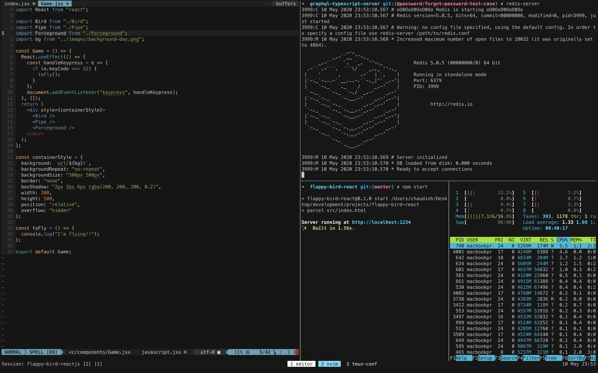

# My Configurations for Neovim, Tmux, and the MacOS X terminal (iTerm2)

This repo is my recent setup for local machine (Macbook Pro 15 inch 2013, runs MacOS Catalina)

## Install

```
git clone git@github.com:ChauDinh/Dotfiles.git
cd Dotfiles/
```

After that, install neovim: 

- Download nvim-macos.tar.gz
- Extract `tar xzvf nvim-macos.tar.gz`
- Run `./nvim-osx64/bin/nvim`

(The install for other OS systems can be found [here](https://github.com/neovim/neovim/releases))

Open the file `nvim/init.vim` to install plugins

```
nvim nvim/init.vim
:PlugClean
:PlugInstall
:PlugUpdate
```

And, finally, the result would be like this (with base16 colorscheme 👻)


